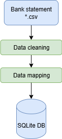

Data cleaning
==========================

This section describes the data cleaning process for FinTrack.  
It covers how raw bank data is standardized, cleaned, and imported into the database.

   workflow data cleaning 

Modules
----------

db\_update.py module
------------------------------------

.. automodule:: 03_data_cleaning.db_update
   :members:
   :show-inheritance:
   :undoc-members:

Module contents
---------------

.. automodule:: 03_data_cleaning
   :members:
   :show-inheritance:
   :undoc-members:
