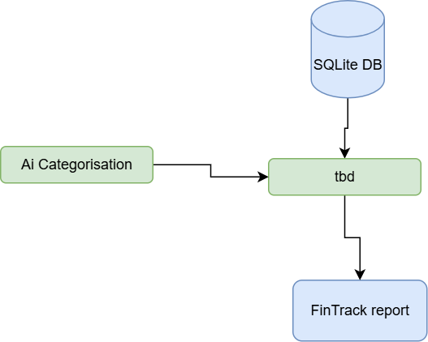

Data analysis
====================

This section describes the data analysis process for FinTrack.  
It covers how the cleaned bank data is analyzed to extract insights and generate reports.

   workflow data analysis

Submodules
----------

analysis.py module
----------------------------

.. automodule:: 05_analysis.analysis
   :members:
   :show-inheritance:
   :undoc-members:

Module contents
---------------

.. automodule:: 05_analysis
   :members:
   :show-inheritance:
   :undoc-members:
