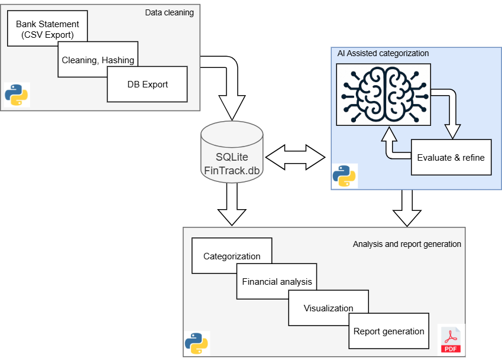

# FinTrack

Welcome to the FinTrack project!

**FinTrack** is an AI-assisted financial analysis toolchain that processes bank statement CSV files, cleans and categorizes transactions, stores them in a SQLite database, and generates insightful reports and visualizations.  
It leverages Python, SQLite, and GenAI to automate and enhance your personal or business financial tracking.

---



---

## Overview

FinTrack loads bank statements in CSV format, cleans and organizes the data into a SQLite database using the `db_update.py` script.  
The AI-based categorization workflow in `07_AI_categorisation` classifies transactions using both AI and keyword-based scripts.  
The `analysis.py` script in `05_analysis` performs data analysis and generates visual reports, including summary tables, cumulative spending plots, and a comprehensive PDF report.

---

## File Structure

- `03_data_cleaning/db_update.py`: Data cleaning and database update script.
- `05_analysis/analysis.py`: Data analysis and report generation script.
- `07_AI_categorisation/main_categorization.py`: Main workflow for AI-based transaction categorization.
- `docs/`: Rendered HTML documentation for the project (served via GitHub Pages).

---

## How to Use

1. **Prepare your data:**  
   Place your bank statement CSV files in the `FinTrack/02_raw_data/` directory.

2. **Import and clean data:**  
   Run the data cleaning script to import and normalize your CSV files into the SQLite database:
   ```sh
   python FinTrack/03_data_cleaning/db_update.py
   ```

3. **AI categorization:**  
   Execute the AI categorization workflow to classify transactions and generate reports:
   ```sh
   python FinTrack/07_AI_categorisation/main_categorization.py
   ```

4. **Data analysis and reporting:**  
   Run the analysis script to create visualizations and compile the final report:
   ```sh
   python FinTrack/05_analysis/analysis.py
   ```

5. **View your results:**  
   The generated PDF report will be available at: [FinTrack report (PDF)](FinTrack/05_analysis/_build/FinTrack_Report.pdf)
   ```
---

## Project documentation

[Project Documentation (HTML)](https://TrivicM.github.io/FinTrack/)

## Example of the FinTrack report

[FinTrack report (PDF)](FinTrack/05_analysis/_build/FinTrack_Report.pdf)

